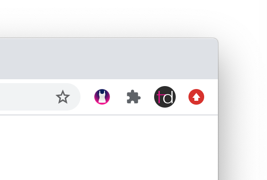
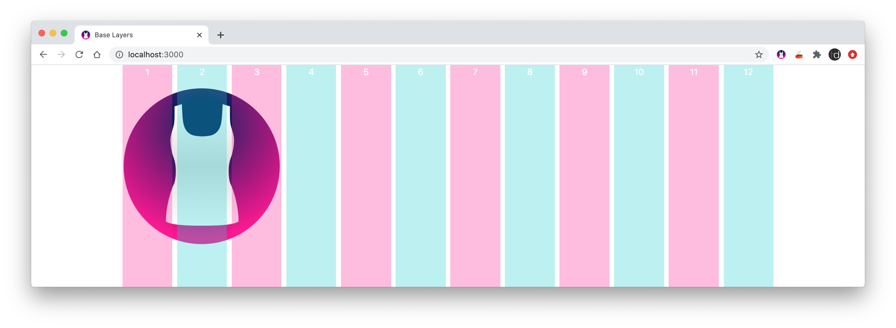

# Base Layers Grid Chrome extension

> Put a grid on it


This Chrome extension is for use with the [Base Layers](https://github.com/tinacious/base-layers) Sass framework.



Just click on the tank top to put a grid on it.

Get it from the [Google Chrome Web Store](https://chrome.google.com/webstore/detail/base-layers/fhkhleopmmdiokahobpnchddheokcldd).



## Installation

1. Download the source code by clicking the Download button at the top right
2. Open Chrome's Extension management page
3. Turn on Developer Mode at the top right if it isn't on already
4. Click "Load unpacked extension"
5. Find this directory and load it in. The root of the directory needs to have the `manifest.json` file

## Distribution

The following command bundles the Chrome extension and includes only the necessary files for distribution:

```sh
./bundle.sh
```

## Changelog

| Version | Changes                                                                                                      |
| :------ | :----------------------------------------------------------------------------------------------------------- |
| 0.2.2   | Support manifest v3                                                                                          |
| 0.2.1   | [Width fix](https://github.com/tinacious/base-layers-chrome/commit/5e2ed1c8a94860da40a82b8a01aeae3094c9dd83) |
| 0.1.0   | Initial release 🚀                                                                                           |
